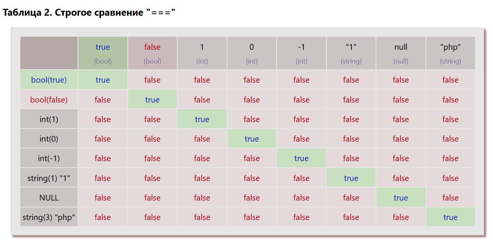

## Домашнее задание 11.7.1: Таблицы истинности и сравнения (HW_03)
## курса PHP-Pro (Skillfactory)
Автор: Александр Климок / [kydechuk01](https://github.com/kydechuk01/)
 Дата: 29.03.2024 

### В работе использованы:
- HTML5, CSS, JS, Markdown
- Git via [github.com](https://github.com)
- Редактор VSCode

### Файлы проекта

* Открыть файл [index.php](./index.php).

### Список решенных задач
#### **Задание 1.** Таблица истинности PHP.
Заполнены результаты логических операций `!A`, `A || B`, `A & B`, `A xor B`, через логические операции php.

Для каждой строки таблицы внутри PHP-кода задаются переменные `$a` и `$b`. Далее, в каждую ячейку таблицы через php-тег `<?= ?>` вставляется вывод  значений соответствующей логической операции над этими переменными, оборачивая результат через тернарный оператор в строковые значения `false` / `true`.

Чтобы значения `true` и `false` визуально лучше отличались друг от друга, дополнительный javascript просматривает все `td` на странице и в зависимости от наличия этих ключевых слов задает свойство цвета текста в ячейке через CSS.

### **Задание 2.** Таблицы нестрогого (loose) и строгого (strict) сравнений в PHP.

Проводится 2 группы сравнений, нестрогое (с приведением операндов к единому типу) и строгое (полное соответствие типов сравниваемых операндов).

Для каждой строки таблицы внутри PHP-кода задаются переменные `$a` и `$b1 - $b8`. Далее, в каждую ячейку таблицы через php-тег `<?= ?>` вставляется вывод значений соответствующей операции сравнения над этими переменными, обернутый для наглядности через тернарный оператор в строковые значения `false` / `true`.

#### Результаты нестрогого сравнения.

#### Результаты строгого сравнения.

### Выводы

1. Как мы видим из таблицы 1, нестрогое сравнение (==), позволяет более гибко работать со сравниваемыми данными, не приводя их к единому типу, что удобно, когда мы работаем с данными, полученными через браузер, т.к. из HTML-форм данные на сервер передаются в основном только как строковые значения. Например:
   - Сравнение чисел 1, -1, строки "1" или "php" с булевым значением "true" даст true
   - Сравнение числа 0, значения false и NULL даст true
   - Также есть интересные эффекты, например сравнение -1 и true дает true

2. Из таблицы 2 мы видим, что строгое сравнение (===) дает true только в случае полного соответствия и типа операндов и их значений. В остальных случаях мы всегда получаем отрицательный результат.

### Дополнительно решенные задачи:
- Работоспособность проекта оттестирована на локальном веб-сервере с поддержкой PHP (OpenServer Panel)
- Выполнено CSS-оформление таблиц
- Добавлен javascript, который задает индивидуальный цвет ячеек таблиц, содержащих значения true и false.